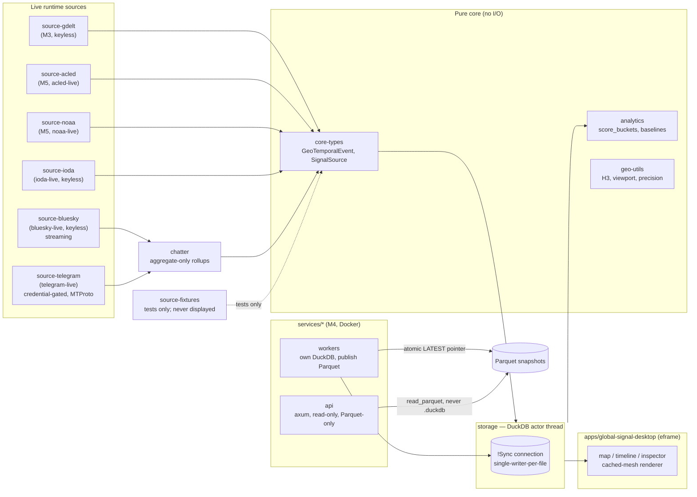

# Live Earth Signals

[](https://github.com/arcTanMyAngle/global_unrest/actions/workflows/ci.yml)
[](#license)
[](rust-toolchain.toml)

A desktop-first geospatial dashboard for seeing where public-interest events
are being reported, how coverage changes over time, and which claims are
supported by event-data providers. It is intended to grow into a place where
journalists and other people on the scene can publish opt-in, real-time field
channels that viewers can follow much like a live broadcast.

The application uses only live, public, or properly authorized sources at
runtime. It preserves source provenance and keeps media attention, provider-
verified events, and future firsthand field reports visibly separate. It does
not call any source "guaranteed ground truth": even sincere eyewitnesses can
be mistaken, delayed, coerced, or impersonated. Instead, the product direction
is **traceable evidence**—identity and consent signals, timestamps, source
history, corroboration, corrections, and a clear confidence state.

**Milestones 1–6 complete** (M6 = repo hygiene/CI/releases; see
[CHANGELOG.md](CHANGELOG.md)), plus the V1 visualization batch and an IODA
internet-outage layer. The desktop runtime is **live-data-only**: **GDELT**
(keyless), **ACLED** (authorized myACLED account), **NOAA/NWS active
alerts** (keyless), **IODA internet-outage events** (keyless), and
fixtures remain test assets but are never loaded into or displayed by the
desktop app.

## Who this is for

- **Journalists and newsrooms** monitoring developing stories, comparing
  coverage with structured event reports, and eventually publishing or
  following consent-based field channels.
- **People in affected areas** seeking a provenance-rich view of nearby
  reports and official alerts without treating a viral post as confirmed.
- **Humanitarian, civic, conflict, and OSINT researchers** studying aggregate
  patterns, coverage gaps, and changes over time.
- **Emergency and weather analysts** viewing US NOAA/NWS polygon alerts
  alongside other signals.
- **Educators and developers** exploring a transparent Rust, DuckDB, H3, and
  Parquet geospatial pipeline.

This is a situational-awareness aid, not a substitute for official emergency
instructions or a promise that an area is safe. The current build does not
provide person-level tracking or live video channels.

## What is available today

| Capability | Status | What it means |
|---|---|---|
| GDELT media attention and events | Live | Global news metadata and CAMEO event records; coverage is not confirmation. |
| ACLED event data | Live with authorized credentials | Curated conflict and civic-event records; access and available dates depend on the account. |
| NOAA/NWS alerts | Live | Active US and territory alerts with polygon geometry; zone-only alerts are not placed at guessed coordinates. |
| IODA internet-outage events | Live | Country-precision internet-outage severity signal (keyless, near-real-time); shades regions only, never a point marker. |
| Map, filters, replay, and inspector | Available | Explore heat, markers, sources, themes, confidence, and six-hour analysis buckets. |
| Related video and source links | Available | Click a region to open video URLs carried by its real source records, inspect source pages that may contain media, or launch a clearly labeled external YouTube search. |
| Local Parquet export and ingest log | Available | Export normalized session data and inspect rejected records. |
| On-scene publisher channels | Planned | Opt-in live video/audio/text with publisher safety controls, provenance, and corroboration states. |

### How to read the evidence

The interface treats these as different evidence classes:

1. **Media attention** says that outlets are covering something. It does not
   prove the underlying claim or that the publisher is located at the event.
2. **Provider event data** is normalized from GDELT Events or an authorized
   provider such as ACLED. It may be curated or corrected later, but is still
   a report rather than infallible truth.
3. **Official alerts** are authoritative notices from their issuing agency,
   within that agency's coverage and update cycle.
4. **Firsthand field reports** are a planned class. They should show whether
   the publisher is authenticated, whether time/location evidence is present,
   whether independent sources corroborate the report, and whether it has been
   corrected or disputed. A `live`, `verified identity`, or `on scene` badge
   must never be presented as proof that every claim is true.

## Architecture



Full crate-by-crate map: [docs/ARCHITECTURE.md](docs/ARCHITECTURE.md).

## Quickstart

```sh
# Copy .env.example to .env and add authorized ACLED credentials if available.
# The first build compiles bundled DuckDB and can take several minutes.
cargo run -p global-signal-desktop
```

You get a dark world map with:

- **Heatmap** — H3 cells shaded by media attention, event count, or source
  diversity (log scale; toggle in the top bar). Cells roll up to coarser H3
  parents at world zoom.
- **Event markers** — protests/conflicts/disruptions as colored diamonds.
  Only city/exact-precision records render as points; country/admin
  centroids shade regions instead of faking hotspots.
- **Time slider** — replay the retained live-data extent in 6-hour buckets.
- **Region inspector** — click anywhere: counts by kind, attention vs.
  events (always separate), **score components as separate bars**
  (attention / unrest / spike-vs-baseline / combined, per
  [docs/SCORING.md](docs/SCORING.md)), low-confidence badges (baseline cold
  start, coarse geocoding), top themes, outlet diversity, headline metadata,
  source links, and related-video actions. Known video hosts/direct media URLs
  are labeled as candidates; external search results remain explicitly
  unverified.
- **Filters** — event kinds, themes (vocabulary from the data), minimum
  location confidence, layer toggles.
- **Parquet export** — one click writes the session as date-partitioned
  Parquet (the M4 service handoff layout).
- **Ingest log** — malformed records are logged and surfaced, never
  silently dropped.

Pan by dragging, zoom with the scroll wheel, `reset view` in the top bar.

### Live updates

Live updates start automatically. GDELT uses the DOC 2.0 API (media
attention, geocoded to source country) plus the 15-minute Events dumps
(discrete CAMEO events), rate-limited and politely backed off. `↻` forces an
immediate fetch; the inspector's **Live source** panels show per-source state
and, if the network drops, a degraded/partial badge. Last-known real data stays
on screen. The **live updates** checkbox pauses network requests without
switching to synthetic data. `LES_ONLINE=0` starts paused.

| Source | Normal fetch cadence | Important limitation |
|---|---:|---|
| GDELT | 15 minutes | Upstream DOC or Events feeds can be partial, delayed, or temporarily unavailable. |
| NOAA/NWS | 10 minutes | US and territories only; only alerts with usable geometry appear on the map. |
| IODA | 15 minutes | Country-precision only — shades regions, never a point marker. |
| ACLED | 12 hours | Credentials, license tier, curation delay, and account date restrictions apply. |

Three times are deliberately kept distinct: the **event/publish time** from
the source, the **ingest time** when this app received it, and the **six-hour
analysis bucket** used by the timeline and scores. A frequent fetch does not
mean that every underlying event is current or independently confirmed.

### ACLED, NOAA, and IODA

```sh
# All three adapters are desktop defaults; `.env` is loaded automatically.
cargo run -p global-signal-desktop
```

ACLED credentials are `ACLED_EMAIL` / `ACLED_PASSWORD` env vars (OAuth —
ACLED retired API keys). Note: ACLED grants **API** access only to
Research/Partner/Enterprise-tier myACLED accounts (institutional email);
Open-tier accounts authenticate but receive `403 Access denied` on data
reads. Without credentials the ACLED status line simply reports itself off.
Some tiers are also **date-restricted** (e.g. only events older than
12 months) — set `LES_ACLED_WINDOW=YYYY-MM-DD|YYYY-MM-DD` to fetch a fixed
historical window instead of the rolling recent one. NOAA and IODA are both
keyless — no credentials or setup needed.

The M4 services take the same features: `cargo run -p workers --features
acled-live,noaa-live,ioda-live` ingests live and publishes Parquet snapshots
that `cargo run -p api` serves (see [docs/API.md](docs/API.md)).

## Commands

```sh
cargo test --workspace                          # all tests (headless)
cargo run -p source-fixtures --bin generate-fixtures   # regenerate fixtures
cargo fmt --all --check && cargo clippy --workspace --all-targets -- -D warnings
cargo deny check                                 # advisories + license allowlist (needs `cargo install cargo-deny`)
docker compose up                                # M4 worker+api stack (see docker-compose.yml)
```

CI (`.github/workflows/ci.yml`) runs all of the above plus the feature
matrix (each of `acled-live`/`noaa-live`/`ioda-live`/`bluesky-live`/
`telegram-live` alone, plus the full union), the ACLED OAuth live-mock
suite, and a `docker compose` smoke test. Tag-driven releases
(`.github/workflows/release.yml`) build desktop binaries for Windows/Linux/
macOS and push worker/api images to GHCR — see [CONTRIBUTING.md](CONTRIBUTING.md).

## Documentation

| Doc | Contents |
|---|---|
| [HANDOFF.md](HANDOFF.md) | Session handoff: current status, next task list, known quirks |
| [docs/PLAN.md](docs/PLAN.md) | The approved project plan, with milestone status |
| [docs/ROADMAP.md](docs/ROADMAP.md) | Forward plan: M6 repo/CI/releases, M7 service hardening, M8 stretch layers |
| [docs/VISUALIZATION.md](docs/VISUALIZATION.md) | Visualization design plan (V1–V3): timeline, anomaly halos, divergence view, ledger |
| [docs/ARCHITECTURE.md](docs/ARCHITECTURE.md) | Crate map, threading model, rendering strategy, single-writer rule |
| [docs/DATA_MODEL.md](docs/DATA_MODEL.md) | `GeoTemporalEvent`, buckets, DuckDB schema, fixtures |
| [docs/SCORING.md](docs/SCORING.md) | Transparent scoring formulas, baseline/spike design (M2) |
| [docs/SAFETY_AND_PRIVACY.md](docs/SAFETY_AND_PRIVACY.md) | Hard rules, licensing, biases, retention |
| [docs/DEVELOPMENT.md](docs/DEVELOPMENT.md) | Setup, env vars, build notes |
| [CONTRIBUTING.md](CONTRIBUTING.md) | PR workflow, quality gates, feature-gating rules for new sources |
| [CHANGELOG.md](CHANGELOG.md) | Milestone-tied version history |

## Roadmap

- **M1 ✅** offline fixture pipeline: ingest → DuckDB → map/timeline/inspector
- **M2 ✅** scoring depth: score components, 28-day median baselines, spike
  detection with cold-start badges, theme filters, Parquet export
- **M3 ✅** live GDELT ingestion (DOC 2.0 API + 15-min Events dumps),
  rate-limited fetch loop, retention, dedup, graceful degradation. Optional
  OSM slippy-tile layer deferred (stretch)
- **M4 ✅** Dockerized services (axum API + ingest worker, Parquet handoff)
- **M5 ✅** ACLED adapter (feature `acled-live`, authorized OAuth access only)
  and NOAA/NWS active-alerts layer (feature `noaa-live`, keyless). AIS /
  CelesTrak remain backlog stretch layers.
- **M6 ✅** repo hygiene: CI feature matrix + compose smoke test, cargo-deny,
  Dependabot, tag-driven releases (desktop binaries + GHCR images),
  CHANGELOG, this README, CONTRIBUTING.md.
- **V1 ✅** visualization batch: timeline histogram, spike halos, severity
  markers, recency fade ([docs/VISUALIZATION.md](docs/VISUALIZATION.md)).
- **IODA ✅** internet-outage events layer (feature `ioda-live`, keyless,
  country-precision).
- **Bluesky ✅** Jetstream chatter-volume layer (feature `bluesky-live`,
  keyless, aggregate-only).
- **Telegram ✅** public-channel chatter-volume layer (feature
  `telegram-live`, credential-gated, aggregate-only, curated channel
  allowlist).
- **Next**: visualization batch V2, M7 service hardening — see
  [docs/ROADMAP.md](docs/ROADMAP.md).

### Product direction: on-scene channels

A future release is intended to let approved journalists and voluntary field
contributors run channels that viewers can tune into in real time. A channel
may carry live or recently recorded video, audio, text updates, and supporting
media. This is **publishing by a consenting source**, not covert tracking.

The feature should ship only with the following foundations:

- **Publisher safety controls:** approximate or hidden location by default,
  optional broadcast delay, emergency stream cutoff, expiring sessions, and
  the ability to remove location metadata before media is distributed.
- **Authentication and provenance:** signed uploads, account and newsroom
  verification where available, original capture time separated from upload
  time, an audit trail for edits, and preserved source attribution.
- **Verification states:** clear labels such as `unreviewed firsthand`,
  `identity verified`, `independently corroborated`, `disputed`, and
  `corrected`; no universal "ground truth" badge.
- **Corroboration:** links between a field report, independent reporters,
  official alerts, and structured event providers without silently blending
  them into one score.
- **Abuse resistance:** reporting and moderation, anti-impersonation controls,
  rate limits, replay/deepfake warnings, and restricted access when a public
  broadcast could endanger a source or bystander.
- **Bystander privacy:** no face recognition, involuntary identity search, or
  precise persistent location histories; retention and download permissions
  remain under an explicit policy.

Real-time delivery and safety can conflict. The publisher—not the viewer—must
control whether exact location and true-live timing are disclosed. Emergency
services and local safety guidance remain authoritative when they differ from
a channel.

## Ethics & data policy

This is a civic-data and voluntary field-publishing tool, not a covert
surveillance or targeting system — see
[docs/SAFETY_AND_PRIVACY.md](docs/SAFETY_AND_PRIVACY.md) for the full policy.
An on-scene contributor choosing to publish a channel is supported; locating,
profiling, or following a person without consent is as well. In short:

- **Aggregate by default** — existing data signals are keyed to H3
  cells/countries and times. A future publisher may opt into a channel, but
  exact location is never inferred or exposed by default.
- **Metadata, not article bodies** — headlines, URLs, outlet domains only.
- **Attention ≠ truth** — media attention and event data are always shown
  as separate, transparent components, never a single blended score.
- **Public/authorized sources only**, rate-limited client-side, never
  bypassing paywalls or auth. ACLED data specifically is never
  redistributed (no `notes` narrative stored; ACLED-bearing snapshots are
  never served publicly — see M7's hardening policy).

## Data & attribution

- Desktop runtime data is live/real-source only. Synthetic fixtures use
  reserved `.example` domains and remain isolated to automated tests; they are
  never loaded into or displayed by the desktop application.
- GDELT data is from the **[GDELT Project](https://www.gdeltproject.org/)**,
  used **with attribution** per its terms (keyless, no redistribution of raw
  dumps). GDELT DOC attention is geocoded only to the *source country* and is
  always shown at country precision—an imperfect, coverage-biased proxy.
- Basemap: [Natural Earth](https://www.naturalearthdata.com/) 1:110m
  countries (public domain).
- ACLED (included in desktop defaults): data from the **Armed Conflict Location &
  Event Data Project (ACLED)**, [acleddata.com](https://acleddata.com) —
  authorized access only (free myACLED account; OAuth credentials via
  `ACLED_EMAIL`/`ACLED_PASSWORD` env vars). Used with attribution; raw ACLED
  data (including event narratives) is never stored or redistributed.
- NOAA (included in desktop defaults): **NOAA/NWS active weather alerts**
  ([api.weather.gov](https://www.weather.gov/documentation/services-web-api)),
  US-government public domain; US coverage only.
- IODA (included in desktop defaults): **Internet Outage Detection and
  Analysis** ([ioda.inetintel.cc.gatech.edu](https://ioda.inetintel.cc.gatech.edu)),
  Georgia Tech Internet Intelligence Research Lab — keyless public API,
  © Georgia Tech Research Corporation. Country-precision internet-outage
  severity signal; aggregate network telemetry only, no person-level data.
- Bluesky (included in desktop defaults): **Jetstream** public firehose
  ([bsky.app](https://bsky.app)) — keyless. This app stores **aggregate
  chatter counts only**: how many public posts in a five-minute window
  mentioned both a known place and a known topic. Post text, author
  handles/DIDs, post ids, and links are never stored, logged, or exposed by
  any API in the source adapter, and place attribution is keyword matching
  against a public gazetteer, never inference about where a person is. See
  [docs/SAFETY_AND_PRIVACY.md](docs/SAFETY_AND_PRIVACY.md) hard rule 6.
- Telegram (included in desktop defaults, credential-gated): a small,
  live-verified, curated allowlist of public channels
  ([telegram.org](https://telegram.org)), read via a dedicated account's own
  MTProto session — not a bot, since Telegram's Bot API cannot read a
  channel it wasn't added to. Same **aggregate chatter counts only**
  guarantee as Bluesky: no message text, sender identity, or message URL is
  ever stored, logged, or exposed by any API in the source adapter. See
  [docs/SAFETY_AND_PRIVACY.md](docs/SAFETY_AND_PRIVACY.md) hard rule 6.

## License

Dual-licensed under MIT or Apache-2.0, at your option.
